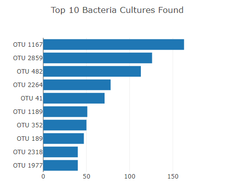

# Belly Button Biodiversity

## Overview

As we helped Roza to visualize the data in html format, Roza then proposed to then visualize the bacterial bidoversity between all participants. By allowing for the voulunteers to identify the 10 species in their belly buttons, it would then allow for Improbable Beef to then identify a species of bacteria in order to manufacture synthesized beef. This would then only be possible if Roza's volunteers can find this specific bacteria in their navel.

## Results

One new addition we created was bar chart that dynamically changes based on the users input from the selection of the volunteers in the drop down list.

For the second deliverable, We also created a bubble chart as well which plots the various bacteria species which also dynamically changes based on selection of volunteers.

![](images/

For the third deliverable, a gauge chart was created that shows a volunteers belly washing frequency per week.

![](images/

The following link displays the website created: https://hammadm12.github.io/Belly_Button_Biodiversity/
